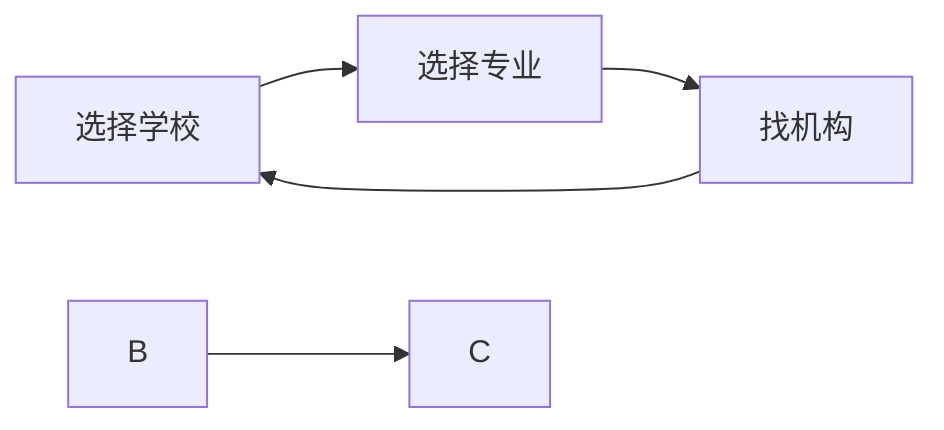

### 学校

- 2022 QS排名从上到下

|       学校       |    地区    | 简称  | 开始与截止时间 |                                 课程网址                                 |
| :--------------: | :--------: | :---: | :------------: | :----------------------------------------------------------------------: |
|     牛津大学     |   牛津市   |       |                |                                                                          |
|     剑桥大学     |   剑桥市   |       |                |                                                                          |
|   帝国理工学院   |    伦敦    |       |                |                                                                          |
|   伦敦大学学院   |    伦敦    |       |                |                                                                          |
|    爱丁堡大学    |   爱丁堡   |       |                |                                                                          |
|   曼彻斯特大学   |  曼彻斯特  |       |                |                                                                          |
|   伦敦国王学院   |    伦敦    |       |                |                                                                          |
| 伦敦经济政治学院 |    伦敦    |  LSE  |                | [课程](https://www.lse.ac.uk/study-at-lse/Graduate/Available-programmes) |
|     华威大学     |  科芬特里  |       |                |                                                                          |
|   布里斯托大学   | 布里斯托市 |       |                |                                                                          |
|   格拉斯哥大学   |  格拉斯哥  |       |                |                                                                          |
|   南安普敦大学   |  南安普顿  |       |                |                                                                          |
|     杜伦大学     |    杜伦    |       |                |                                                                          |
|    伯明翰大学    |   伯明翰   |       |                |                                                                          |
|  圣安德鲁斯大学  | 圣安德鲁斯 |       |                |                                                                          |
|     利兹大学     |    里兹    |       |                |                                                                          |
|   谢菲尔德大学   |  谢菲尔德  |       |                |                                                                          |

- 其他项目

| 简称  |    全称    | 简介  |
| :---: | :--------: | :---: |
|  UCL  | University |

### 研究生分类

| 简称  |               全称                |          分类          |
| :---: | :-------------------------------: | :--------------------: |
|  MA   |       Master of Arts degree       |       艺术生硕士       |
|  MSc  |         Master of Science         |        理学硕士        |
| Mphi  |       Master of Phisolophy        | 研究性硕士，读博前需要 |
|  Phd  |       Doctor of Phisolophy        |          博士          |
|  LLM  |          Master of Laws           |        法学硕士        |
|  MPA  |  Master of Public Administration  |      公关管理硕士      |
|  MPP  |      Master of Public Policy      |      公共政策硕士      |
|  MBA  | Master of Business Administration |      商业管理硕士      |
|  UCL  |     University College London     |      伦敦大学学院      |

### 专业 

| 学校 |  
